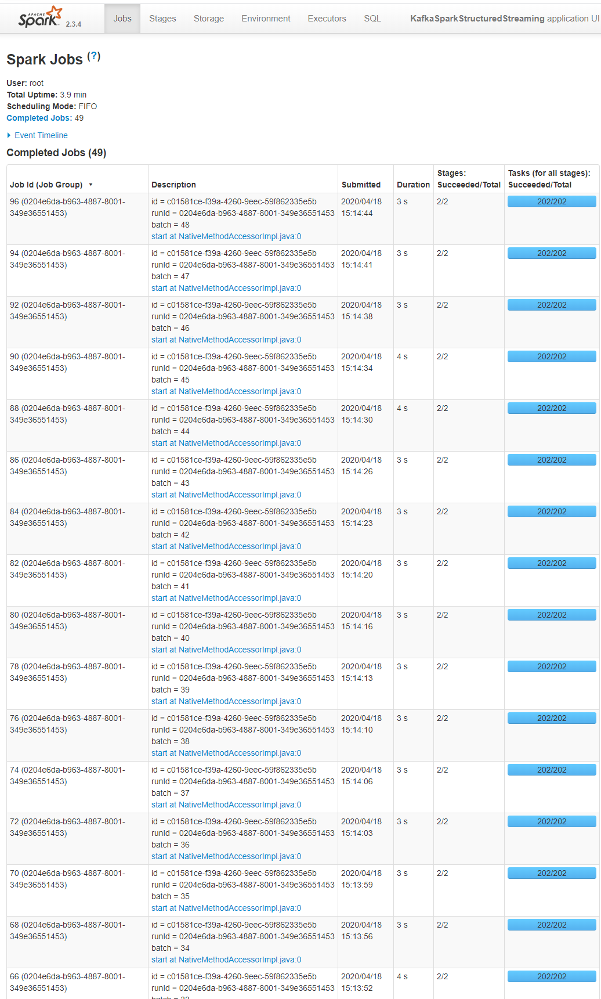
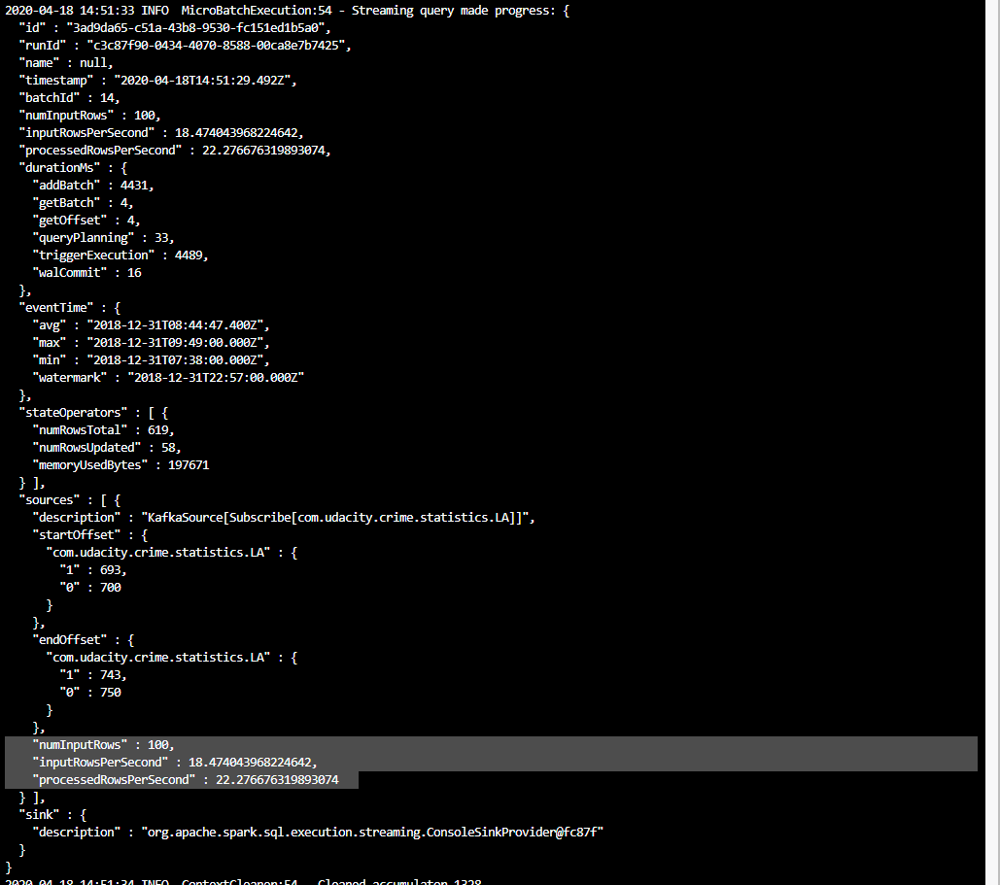

# Udacity SF Crime Statistics with Spark Streaming

## 1. Introduction

In this project, you will be provided with a real-world dataset, extracted from Kaggle, on San Francisco crime incidents, and you will provide statistical analyses of the data using Apache Spark Structured Streaming. You will draw on the skills and knowledge you've learned in this course to create a Kafka server to produce data, and ingest data through Spark Structured Streaming.

## 2. Run the project

1. Start by installing necessary libraries and packages

    ```
    ./start.sh
    ```

2. Start Zookeeper and your Kafka Server using the following commands:

    ```
    /usr/bin/zookeeper-server-start ./config/zookeeper.properties
    ```
    ```
    /usr/bin/kafka-server-start ./config/server.properties
    ```

3. Run the kafka_server.py to initialize the producer and the topic
4. Test if topic creation was successful and topic is listed
    ```
    kafka-topics --list --zookeeper localhost:2181
    ```

5. Run consumer_server.py to get consumed messages and check correctness or run kafka consumer in terminal with the following command

    ````bash
    kafka-console-consumer --bootstrap-server localhost:9092 --topic com.udacity.crime.statistics.LA --from-beginning
    ````

6. Run data_stream.py with the following command

    ```
    spark-submit --packages org.apache.spark:spark-sql-kafka-0-10_2.11:2.3.4 --master local[*] data_stream.py
    ```

## 3. Screenshots

A screenshot of the output of the consumer:


A screenshot of the count result for Crime Types by hour and day 


A screenshot of the UI while Streaming jobs are executed:



A screenshot of the progress reporter in the console:



## 4. Requirements

* Spark 2.4.3
* Scala 2.11.x
* Java 1.8.x
* Kafka build with Scala 2.11.x
* Python 3.6.x or 3.7.x

## 5. Respond to questions for successful project submission

How did changing values on the SparkSession property parameters affect the throughput and latency of the data?

What were the 2-3 most efficient SparkSession property key/value pairs? Through testing multiple variations on values, how can you tell these were the most optimal?